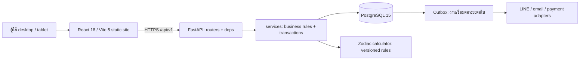

# ขั้นที่ 2 — สถาปัตยกรรมและการส่งมอบ

สถานะ: แบบเสนอให้ตรวจ; ผู้ใช้สั่ง “ทำต่อ” หลังเอกสารขั้นที่ 1 จึงเดินหน้าการออกแบบ ไม่ใช่การอนุมัติสร้างบริการ Render หรือเผยแพร่โค้ดในขั้นนี้

## การตัดสินใจ

ใช้ modular monolith: FastAPI หนึ่งแอปแบ่งโดเมนตาม resource และ PostgreSQL หนึ่งฐานข้อมูล เพราะงานจอง จ่ายยา และรับเงินต้องการ transaction ที่ตรวจสอบง่าย ทีมยังไม่จำเป็นต้องดูแลหลายบริการ Stack ทุกตัวตาม stack.txt คงเดิม

Frontend ใช้ React Router แบ่ง pages และ layouts ตามบทบาท, axios รวมศูนย์, Tailwind 3, recharts สำหรับรายงาน, vitest สำหรับพฤติกรรมสำคัญ Backend ใช้ dependencies ตรวจ identity, permission, branch และ object access; routers รับ/ส่ง Pydantic schemas; services เป็นเจ้าของ transaction; models ไม่จัดการ HTTP

## ขอบเขตโมดูลและ FR

| โมดูล | FR |
|---|---|
| identity / clinic | 01, 02, 25 |
| patients / privacy | 03, 04, 21, 29 |
| scheduling / resources / queues | 05, 06, 26 |
| clinical / zodiac / documents | 07–13, 23 |
| pharmacy / inventory / procurement | 14–17 |
| billing / packages / accounting | 18–20, 27 |
| communication / tasks | 22, 24 |
| reporting / audit / approval | 28, 30 |
| operations / integrations / knowledge / AI | 31–33 |

## ธุรกรรมที่ต้องออกแบบเป็นพิเศษ

### นัดหมายและเตียง

เสนอ slot ย่อยตาม booking quantum ที่ตั้งค่าและยังรอยืนยัน ระยะเวลาบริการและเตรียมห้องต้องหาร quantum ลงตัว; ห้ามปัดเวลาจนเกิดการทับซ้อน resources รวมผู้รักษา ห้องและเตียง; กำหนด resource requirements ต่อบริการ หลีกเลี่ยงการยึดทั้งห้องโดยไม่จำเป็นเมื่อมีหลายเตียง

ตาราง resource_slots สร้างล่วงหน้าโดย unique(resource_id, start_at) และช่วงเวลาไม่ทับกัน ทุกการจองใช้ UPDATE ... WHERE status='available' AND start_at >= ... AND start_at < ... ทีละ resource ตามลำดับ ID คงที่ ตรวจ rowcount เท่าจำนวน slot ที่ต้องใช้ทุก resource หากไม่ครบ rollback ทั้ง transaction ไม่ใช้ผล SELECT เป็นหลักฐานว่าจองได้

เลื่อนนัด: transaction เดียวคืน slot เดิมแล้วจองชุดใหม่ ถ้าชุดใหม่ไม่ครบ rollback คืนนัดเดิมทั้งชุด; cancel ต้อง conditional transition ของนัดก่อนคืน slot ที่มี appointment_id ตรงกัน การปิดทรัพยากร/เปลี่ยนเวรใช้กลไก slot เดียวกันและคืน conflict ถ้ามี booking ไม่ยกเลิกนัดเงียบ

### ยาและคอร์ส

UPDATE stock_balances SET available_quantity=available_quantity-:qty WHERE ... AND available_quantity>=:qty AND status='available' พร้อมเงื่อนไขล็อตไม่หมดอายุ; ตรวจ rowcount=1 และเขียน movement ใน transaction เดียว ล็อตและ balance ที่ถูกระงับต้องใช้ write path เดียวกันเพื่อกัน race กับ recall

หน่วยคำนวณใช้ NUMERIC, factor ต้องมากกว่าศูนย์; จำนวนจ่ายต้องไม่เกินคำสั่งที่ยังเหลือ โดย conditional decrement ที่ prescription_items ด้วย คืนยาเข้ากักตรวจ ไม่กลับ available ทันที คอร์สใช้ conditional decrement เช่นเดียวกัน

### เงินและการส่งคำขอซ้ำ

จำนวนเงิน NUMERIC(14,2) และ currency THB ใน P1; snapshot ราคา/ส่วนลดขณะออกเอกสาร การชำระใช้ payment + allocations; deposit แยก ledger ไม่ถือเป็นรายได้ซ้ำเมื่อใช้จ่าย invoice

Idempotency-Key จำเป็นสำหรับจอง รับเงิน คืนเงิน จ่ายยาและตัดคอร์ส: unique(actor_id, operation, key), request hash, ผลตอบกลับและ resource ID ใน transaction เดียว การแย่ง insert รอผล unique constraint; key เดิม body ต่างคืน 409; retry ที่ commit แล้วคืนผลเดิมไม่เขียนซ้ำ

Refund conditional decrement ยอด refundable ของ payment พร้อม ledger ใน transaction เดียว; คืนคอร์ส/สต็อกตามรายการและนโยบายที่อนุมัติ ไม่อนุมานว่าทุก refund ต้องคืนของ; ห้ามลบใบเสร็จ ใช้ reversal และเหตุผล

### เวชระเบียนและจักรราศี

Draft มี version สำหรับ optimistic concurrency; ส่ง version เก่าคืน 409 Signed revision ห้าม UPDATE/DELETE ใน write path และใช้ DB guard ผ่าน migration; amendment เป็น revision ใหม่ชี้ฉบับเดิม

Zodiac calculator เป็น pure service รับวันที่และ ruleset_version ไม่เรียก AI; schema รองรับผล unavailable พร้อมเหตุผล ผลที่คำนวณเก็บเป็น immutable snapshot และอ้างใน visit วันเกิดแก้แล้วสร้าง snapshot ใหม่พร้อม audit ไม่เปลี่ยน visit เก่า กฎยังไม่เปิดใช้งานจนตรวจ PDF/ปฏิทินและ fixture กับผู้ใช้ ห้ามเดาขอบเขตจากรูปเพียงอย่างเดียว

## Identity และความปลอดภัย

JWT ระยะสั้นผ่าน Authorization Bearer; frontend เก็บ access token ใน memory; P1 reload ต้อง login ใหม่เพื่อไม่เพิ่ม persistent token โดยไม่จำเป็น ตรวจ active user และ session ที่ยังไม่ revoked จาก DB ทุก request จึง logout/ระงับบัญชีได้จริง Password hash bcrypt, secret ผ่าน config.py, จำกัด login attempts ด้วย slowapi

สิทธิ์เป็น action permissions + branch membership + patient assignment; ผู้ดูแลเทคนิคไม่อ่านเวชระเบียนโดยปริยาย ข้อมูลไม่ใช่ของสาขาที่ได้รับสิทธิ์คืน 404 เพื่อลดการเปิดเผยว่ามี record; ไม่มี action permission คืน 403 Public endpoints ผ่าน public-access dependency และคืน schema ที่ไม่มี PII

Audit เก็บ actor/action/resource/time/request_id และสรุปการเปลี่ยนแปลงที่จำเป็น ไม่เก็บรหัสผ่าน token หรือ request body ทั้งก้อน การอ่านข้อมูลสำคัญเขียน access audit ด้วย account ของแอปไม่มีสิทธิ์แก้/ลบ audit; migration account แยกในการใช้งานจริง

## Render และไฟล์

Blueprint เป้าหมาย 3 resource: static frontend, Python backend, PostgreSQL 15 ระบุ postgresMajorVersion ชัดเจน ไม่ใช้ค่า default; PYTHON_VERSION=3.11.9; JWT_SECRET generateValue; ค่าลับอื่น sync:false

Backend rootDir=backend; build ติดตั้ง requirements; start python -m alembic upgrade head แล้ว uvicorn app.main:app --host 0.0.0.0 --port "$PORT" ภายใต้การ deploy เดียวใน P1; ไม่ขยาย instance ก่อนออกแบบ migration serialization

Frontend rootDir=frontend; build npm ci && npm run build; publish dist; rewrite /* → /index.html; VITE_API_BASE_URL เป็น URL backend ที่ไม่ใช่ secret; CORS allowlist URL frontend จริงเท่านั้น ไม่เปิด wildcard credentials

ใช้ DB internal URL ภายใน region เดียวกัน ปิด public DB network access ตามการตั้งค่าที่ตรวจได้ตอน deploy ตรวจ connection URL/driver PostgreSQL ให้เข้ากับ SQLAlchemy โดยไม่ log credentials

ไฟล์แนบ P1 เสนอเก็บ metadata + binary ใน PostgreSQL เพื่อคง stack และ backup เป็นชุดเดียว กำหนด MIME allowlist, ขนาดสูงสุดจาก config และตรวจชนิดไฟล์จริง; ไม่รับ HTML/SVG ที่รัน script และไม่เผย public URL; ดาวน์โหลดผ่าน auth เป็น attachment วิธีนี้ทำให้ DB โตตามไฟล์ ต้องทดสอบขนาดและตกลงเพดานก่อนใช้งานจริง หากต้องเก็บวิดีโอ/ไฟล์มากเสนอ object storage ภายหลังและขออนุมัติก่อนเพิ่มเทคโนโลยี

Outbox ใน PostgreSQL รองรับ P2; ไม่เรียก provider ภายใน transaction จอง Scheduler/worker สำหรับเตือนนัดยังต้องเลือกแผนรันบน Render และงบก่อนเชื่อมจริง ไม่อ้างว่า 3 services ทำงาน background แบบทนทานได้แล้ว

## หน้าจอและสถานะ

- ต้อนรับ: งานวันนี้ → ค้น/เพิ่มคนไข้ → ปฏิทินผู้รักษา/เตียง → เช็กอิน
- ผู้รักษา: คิวของฉัน → ประวัติ/แพ้ยา → ซักประวัติ/ตรวจ → ธาตุ/สมุฏฐาน/จักรราศี → แผน/คำสั่ง → ลงนาม
- จ่ายยา: คำสั่งยืนยัน → เลือกล็อต/จำนวน → ตรวจ/จ่าย → ฉลาก
- การเงิน: ใบแจ้งรายการ → รับเงิน/ใช้มัดจำ → ใบเสร็จ → ปิดยอด
- ผู้จัดการ: รายงาน → รายการรออนุมัติ → ตั้งค่า/ผู้ใช้
- ทุกฟอร์มมี loading, empty, validation, permission denied และ conflict ที่กู้สถานะได้ ไม่ทำ UI เสมือนสำเร็จก่อน API commit

## ขั้นตรวจรับก่อนเริ่ม scaffold

ตรวจคู่กับ 02-data-model.md และ 02-api-spec.md ยังไม่มีการสร้าง repo, migration, services Render หรือ login ภายนอก ชื่อ repo/GitHub owner ยังรอยืนยัน ข้อมูลจริงของบุคลากร/บริการใช้ configuration ไม่ hardcode

แหล่งเทคนิคที่ตรวจในขั้นนี้:
- https://render.com/docs/blueprint-spec
- https://render.com/docs/redirects-rewrites
- https://www.postgresql.org/docs/15/applevel-consistency.html
