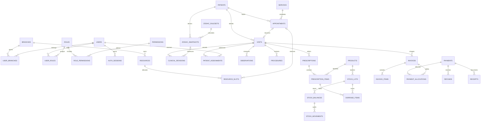

# ขั้นที่ 2 — ER และพจนานุกรมข้อมูล

สถานะ: แบบเสนอ P1 พร้อมขอบเขตขยาย P2–P4; ยังไม่ใช่ migration ที่รันแล้ว
ทุกตารางธุรกิจมี UUID PK; เวลาใช้ timestamptz; วันเกิด date + precision; FK จำกัดการลบ record ที่อ้างถึง; ไม่ soft-delete transaction เพื่อซ่อนประวัติ ใช้สถานะยกเลิก/ระงับ

## ER งานหลัก

## Data dictionary P1

| ตาราง/กลุ่ม | ฟิลด์และข้อบังคับสำคัญ |
|---|---|
| branches | code unique, name, timezone, active; P1 seed หนึ่งสาขา ไม่ hardcode จำนวนสูงสุด |
| users, auth_sessions | normalized_email unique, password_hash, active; session user_id, expires_at, revoked_at; ไม่เก็บ plaintext |
| roles, permissions, user_roles, role_permissions, user_branches | unique คู่ FK; สิทธิ์อย่าง clinical.read, clinical.sign, billing.refund.approve |
| practitioner_profiles, practitioner_services | user_id unique, credential metadata; unique practitioner/service; ตรวจบริการที่ทำได้ |
| services, resources, service_resource_requirements | duration_minutes, buffer_minutes, price; resource type practitioner/room/bed, parent_id nullable; requirements จำนวนต่อชนิด |
| resource_slots | resource_id, start_at, end_at, status, appointment_id nullable; unique(resource_id,start_at); end>start; grid ตาม quantum เดียวกันต่อ resource |
| patients | patient_no unique, name, contact, birth_date nullable, birth_date_precision, birth_date_version, merged_into nullable |
| patient_contacts, patient_access_grants | ความสัมพันธ์/ผู้ติดต่อ; access grant มี scope, valid_until, revoked_at และหลักฐาน; ผู้ติดต่อฉุกเฉินไม่ใช่ผู้มีสิทธิ์ portal อัตโนมัติ |
| patient_health_profiles, allergies, current_medications | assessment_status และรายละเอียดแบบมีประวัติ; unknown/none/known แยกกัน |
| appointments | patient_id, branch_id, service_id, start/end, status, version; การเปลี่ยนสถานะต้อง conditional; เก็บ cancellation_reason |
| visits, patient_assignments | visit_no unique ต่อ branch, appointment_id unique nullable, patient_id, branch_id, queue_code, state; assignment visit/user/scope |
| clinical_revisions | visit_id, revision_no, supersedes_id, draft/signed, author_id, signed_at, form_version_id, zodiac_snapshot_id, payload JSONB; unique(visit,revision); signed immutable |
| form_versions | code, version, schema JSONB, approved_by, active; unique(code,version); schema validate ก่อนรับ payload |
| observations, body_marks | visit, instrument_code/version, value/unit, measured_at; missing ไม่เท่ากับ 0; mark มี diagram_version,x,y,side และคำอธิบาย |
| diagnoses, treatment_plans, procedures | visit, author, status, source, diagnosis_text; plan goals/review_date; procedure service/provider/start/end และ outcome |
| referrals, adverse_events, followups | visit, owner, reason, status, due_at, closed_at และผลติดตาม |
| zodiac_rulesets | version unique, source locator/hash, calendar_version, supported range, approved_by/at, status; ยังไม่มี mapping ที่เดาเอง |
| zodiac_snapshots | patient, birth_date_version, ruleset_id nullable, input_date, calculation_status, reason_code, result JSONB, calculated_at; immutable; result ไม่ใช่ diagnosis |
| products, units, unit_conversions | product code unique, base_unit, type; conversion factor NUMERIC>0 มี version; label instructions แยกคำสั่งรายคน |
| stock_lots, stock_balances | lot product/batch/expiry/status; unique(branch,lot,location); quantities NUMERIC>=0; available/quarantine แยก |
| stock_movements | balance, signed_delta, reason, source_type/id, actor/time; immutable และ unique operation item เพื่อกันลงซ้ำ |
| prescriptions, prescription_items | visit, prescriber, signed_at; item product,dose,route,frequency,duration,instructions,ordered_qty,remaining_qty; qty>=0 |
| dispenses, dispense_items | visit/prescription, dispenser, status; item prescription_item,lot,qty>0; ยอดไม่เกินคำสั่งที่เหลือ |
| invoices, invoice_items | patient,visit,branch,status,currency,totals; item description/price/discount snapshot; รายการที่ออกแล้ว immutable |
| payments, payment_allocations | patient,branch,amount,channel,status,external_ref,refundable_amount; allocation invoice/amount; ยอด allocate ไม่เกินยอด payment/invoice ผ่าน conditional balance updates |
| deposit_entries | patient,payment,delta,invoice nullable,reason; ใช้ balance conditional และ ledger; ไม่รวมเป็นยอดขายก่อนนำไปชำระ |
| refunds, receipts, document_counters | original payment,amount,approval,reason; receipt unique(branch,series,number); counter UPDATE RETURNING ไม่ MAX+1 |
| cash_sessions, cash_reconciliation_lines | branch,operator,opened/closed_at,expected,actual,difference,reviewer; ยอดคาดหมายอ้าง ledger |
| approvals | action,target,requester,reviewer,decision,reason,policy_version; การอนุมัติตรวจ version ของรายการก่อนทำจริง |
| attachments, attachment_contents | owner relation, MIME,size,sha256,access_scope; bytea แยกจากรายการ metadata เพื่อไม่โหลด binary ทุก query |
| consent_records | patient,form_version,signer,relationship,signed_at,attachment; ไม่เปลี่ยนฉบับเดิมตาม template |
| audit_events, idempotency_records | actor,action,target,request_id,time; idem unique(actor,operation,key),hash,response/resource; ไม่มี secret |

## ส่วนขยาย P2–P4

| กลุ่ม | ตารางและความสัมพันธ์ |
|---|---|
| P2 จัดซื้อ/ผลิต | suppliers → purchase_orders → purchase_items → goods_receipts; formula_versions → formula_items; production_batches → material_consumptions → stock_lots; recall_cases → recall_contacts |
| P2 คอร์ส | package_versions → patient_packages → package_entries; redemption เชื่อม visit และ reversal อ้างรายการเดิม |
| P2 สื่อสาร | notification_preferences, waitlist_entries, outbox_events, delivery_attempts, tasks, surveys, complaints; dedupe_key unique; portal identity → patient_access_grants |
| P2 ข้อมูล | import_jobs → import_rows, patient_merge_events, privacy_requests, knowledge_sources → knowledge_versions |
| P3 บริหาร | rosters, leave_requests, credential_records, compensation_rules/entries, expense_entries, supplier_payables, stock_transfers/items, maintenance_jobs |
| P3 เชื่อมต่อ | claims → claim_attempts, lab_orders → lab_results, device_observations; provider_reference unique ภายใน provider |
| P4 AI | ai_drafts → review_events; source record IDs, model/config version, input/output access policy; ห้ามเปลี่ยน signed clinical revision โดยตรง |

## Index และ invariant

- appointments(branch_id,start_at,status), visits(branch_id,date,state), patient_assignments(user_id,visit_id), resource_slots(resource_id,status,start_at)
- patients(patient_no), normalized_phone สำหรับ exact search; ประสิทธิภาพค้นชื่อวัดก่อนเพิ่ม extension
- stock_lots(product_id,expiry), stock_movements(balance_id,created_at), clinical_revisions(visit_id,revision_no)
- payment/refund/reconciliation indices ตาม branch/time; audit(target_type,target_id,time)
- FK branch ของ visit/invoice/stock ต้องสอดคล้องกัน ใช้ composite FK/constraints เมื่อเหมาะสม ไม่เชื่อ branch_id จาก client
- การแก้ไข/ยกเลิกใช้ expected version หรือ conditional state; ทุก invariant มี tests ทั้งสำเร็จและ rollback
- รายละเอียด JSONB ใช้เฉพาะฟอร์มและผลคำนวณมี schema version; เงิน สต็อก สิทธิ์และ FK ใช้ relational columns
